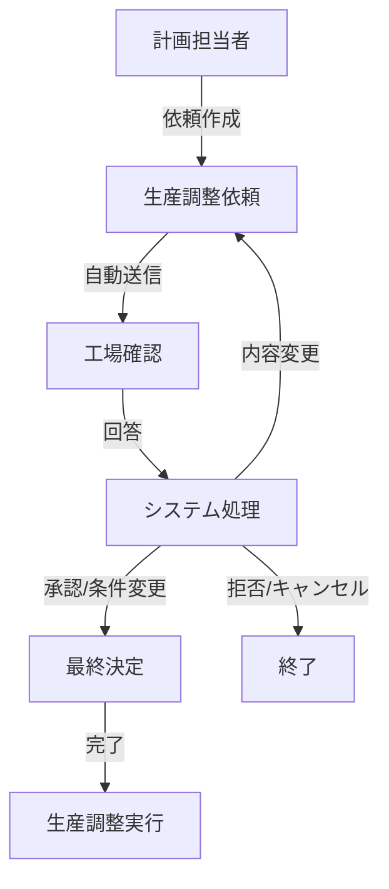

# Production Operation Management Solution

## 概要

Production Operation Management Solution（生産調整管理システム）は、製造業における生産数量の調整業務を効率化するためのソリューションです。委託先工場に対する生産調整依頼の作成・送信から、工場回答の管理、ステータス追跡まで、生産調整プロセス全体を統合的に管理します。

## 主要機能

### 🎯 生産調整計画
- 増産・減産の依頼作成と送信
- 工場選定と最適化
- 優先度設定とスケジュール管理
- 依頼理由と詳細条件の記録

### 📊 ステータス管理
- リアルタイムでの調整状況追跡
- 工場回答の自動受領・処理
- ステータス変更履歴の管理
- 期限アラートと通知機能

### 🏭 工場管理
- 工場情報と生産能力の管理
- 専門分野による自動フィルタリング
- 工場別パフォーマンス追跡
- 連絡先と稼働状況管理

### 🔄 自動化機能
- メール・Teams連携による自動通信
- 工場選定アルゴリズム
- 回答処理の自動化
- ステータス更新の自動化

## システム構成

### アーキテクチャ
```
[ユーザー] ↔ [Webアプリケーション] ↔ [自動化エージェント] ↔ [外部通信]
                      ↓                        ↓
                [データベース]            [メール・Teams]
```

### 主要コンポーネント
- **Coordination Agent**: 全体ワークフロー統括
- **Factory Selection Agent**: 最適工場選定
- **Communication Agent**: 外部通信管理
- **Response Processing Agent**: 回答自動処理
- **Status Management Agent**: ステータス管理

## ワークフロー



## ステータス定義

| ステータス | 説明 | 色分け |
|-----------|------|--------|
| 送信済み | 工場に依頼送信完了 | 青色 |
| 確認中 | 工場で検討中 | オレンジ色 |
| 回答済み | 工場から回答受領 | 紫色 |
| 承認済み | 依頼内容承認完了 | 緑色 |
| 完了 | 生産調整実行完了 | 濃緑色 |
| 拒否 | 工場から拒否回答 | 赤色 |
| キャンセル | 依頼キャンセル | グレー色 |

## ユーザー役割

### 👤 計画担当者
- 生産調整依頼の作成・管理
- 工場回答の承認・条件変更
- 依頼ステータスの確認・更新

### 🏭 工場管理者
- 依頼内容の確認・検討
- 受諾可否・条件回答
- 生産状況の報告

### 👨‍💼 管理者
- システム全体の管理
- ユーザー・工場・製品マスタ管理
- レポート・分析機能

## データモデル

### 主要エンティティ
- **ProductionAdjustmentRequest**: 生産調整依頼
- **Factory**: 工場マスタ
- **Product**: 製品マスタ
- **User**: ユーザー管理
- **FactoryResponse**: 工場回答
- **StatusHistory**: ステータス履歴

### リレーションシップ
```
User ←→ ProductionAdjustmentRequest ←→ Factory
          ↓
       Product ← FactoryResponse
          ↓
    StatusHistory
```

## 技術仕様

### フロントエンド
- レスポンシブWebアプリケーション
- モダンブラウザ対応
- アクセシビリティ準拠（WCAG 2.1 AA）

### バックエンド
- REST API アーキテクチャ
- データベース統合
- 外部API連携（メール・Teams）

### セキュリティ
- ユーザー認証・認可
- データ暗号化
- 監査ログ記録

### パフォーマンス
- 応答時間: 3秒以内
- 同時利用: 100ユーザー
- 稼働率: 99.5%以上

## ファイル構成

```
POMSolution/
├── readme.md                 # このファイル
├── solution.md              # 詳細システム設計書
├── ui-design.md             # UI設計仕様書
├── agent-architecture.md    # 自動化エージェント設計書
└── data/                    # サンプルデータ
    ├── users.csv            # ユーザーマスタ
    ├── factories.csv        # 工場マスタ
    ├── products.csv         # 製品マスタ
    ├── production_adjustment_requests.csv  # 生産調整依頼
    ├── factory_responses.csv              # 工場回答
    └── status_history.csv                 # ステータス履歴
```

## 期待効果

### 効率化
- 手動作業の80%削減
- 処理時間の大幅短縮
- ヒューマンエラーの撲滅

### 品質向上
- データ駆動による最適化
- 標準化されたプロセス
- 完全な監査証跡

### 可視性向上
- リアルタイムステータス確認
- 包括的なレポート機能
- 履歴・分析データの活用

---

詳細な設計仕様については、以下のドキュメントを参照してください：
- [システム設計書](solution.md)
- [UI設計書](ui-design.md)
- [自動化エージェント設計書](agent-architecture.md)
